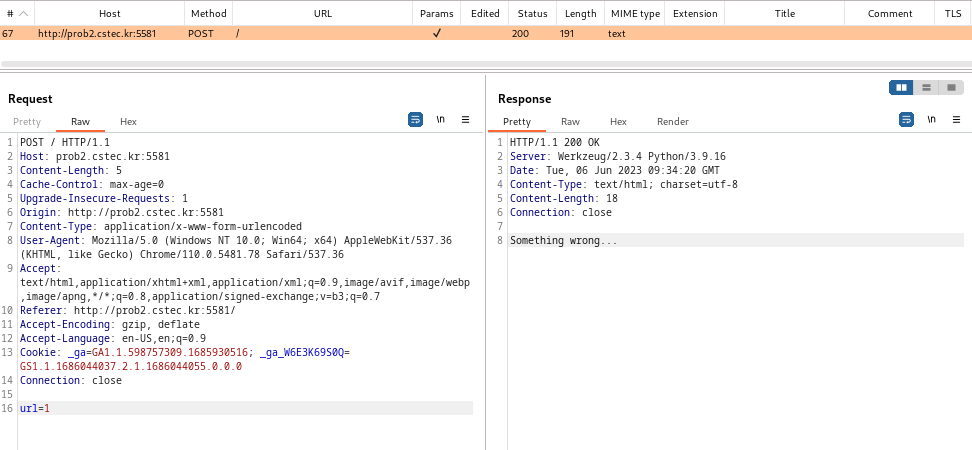
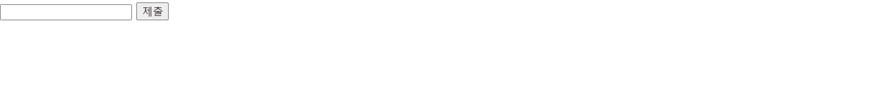

# 2023 CCE 훈련장 Web문제

참고로 이 문제... 문제를 풀고나서 찾아보니 22년도 문제였기도 하다?!

작년 CCE도 참가했었는데 이 문제가 왜 생각이 안났을까

그 당시에는 포랜식 문제만 풀고 있었다보니 생각이 안나는거 같다^^..

아무튼.. 필자의 목적은 아직은 본선,우승 보다도 적응이 되는 것이 우선이다보니

이 훈련장 문제를 풀어보자!



WEB HACKING \[100] - BabyWeb

웹 해킹의 기본이라고만 적혀있다.. ㅋㅋㅋ 웃프게도 딸랑 저게 끝이 맞다..

<figure><figcaption></figcaption></figure>




문제를 봐보자

무언가 메시지 창과 '제출' 버튼만 있다.. 와우.. 답답하게도  진짜 뭐가 안보인다!

<figure><figcaption></figcaption></figure>


버프 스위트로 봐도 별거 없다;

<figure><figcaption></figcaption></figure>


그럼 남은 것은 첨부파일뿐!!

압축을 풀면 아래와 같이 파일들이 나오는데..

<figure><figcaption></figcaption></figure>


여기에서 public, internal의 폴더 명에 있는 파일들 중에서 app.py를 유심히 봤다.

<figure><figcaption></figcaption></figure>


secret.py를 보면 flag가 여기에 들어가는거 같고

<figure><figcaption></figcaption></figure>




그럼 flag를 찾아야하는데 음....

app.py에서 소스코드가 어떻게 돌아가는지 보자

우선 urllib, urllib.parse, requests, ipaddress, socket 등을 사용했다.

import만 봐도 url 갖고 문제를 푸는거 같아보이는데...



<figure><figcaption></figcaption></figure>


아래 소스코드도 보자, 주로 flag에 해당이 짐작되는 부분만 보면 될거 같다.

<figure><figcaption></figcaption></figure>


아래 소스코드 부분은 urlparse()함수는 URL 문자열을 인수로 사용하는 함수이고 'flag.service'일때 Not allow 허용되지 않는 소스코드 부분이고

```
try:
            url = request.form['url']
            result = urllib.parse.urlparse(url)
            if result.hostname == 'flag.service':
                return "Not allow"
```




아래 소스코드 부분은 ip가 valid 다를때 'huh??'의 결과가 나오는 소스코드 부분이다.

result.hostname은 hostname을 'flag.service'로 필터링 하는것으로 보인다.

즉, hostname이 flag.service여야 통과가 되는 것으로 짐작이 된다.

```
 else:
                if(valid_ip(result.hostname)):
                    return "huh??"
```


그리고 아래의 소스코드 부분은 hostname이 다르면 'Someting worng' 문구의 결과창을 내주는 소스코드인거 같다.

```
else:
                    return requests.get("http://"+result.hostname+result.path, allow_redirects=False).text
        except:
            return "Something wrong..."
    elif request.method == "GET":
        return data
```


그럼 url에 flag.service로 입력을 하면 flag가 나오는지 확인해봤는데 통과가 안된다.

<figure><figcaption></figcaption></figure>


여기에서 짐작할 것은 우회라는것!

문자열 S를 HTML URL Encoding을 하여 우회를 해보니 flag가 나왔다.

<figure><figcaption></figcaption></figure>






